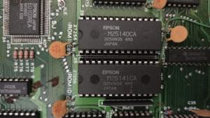
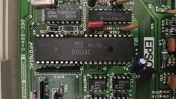

# 🖼️ Epson QX-11 Photo Gallery

Photos courtesy of [ettore](https://forum.vcfed.org/index.php?members/ettore.63209/) from the [Vintage Computer Forum](https://forum.vcfed.org/index.php?threads/epson-qx-owners-please-join.1209041/post-1382394).  
Used here under fair use for historical and educational purposes.

---

## 📷 Image Gallery

Click thumbnails to view full resolution.

<table>
  <tr>
    <td></td>
    <td></td>
  </tr>
  <tr>
    <td></td>
    <td></td>
  </tr>
  <tr>
    <td></td>
    <td></td>
  </tr>
  <tr>
    <td></td>
    <td></td>
  </tr>
</table>

---

📂 Folder: `photos/vcf_qx11/`  
📝 [Attribution and context](README.md)
