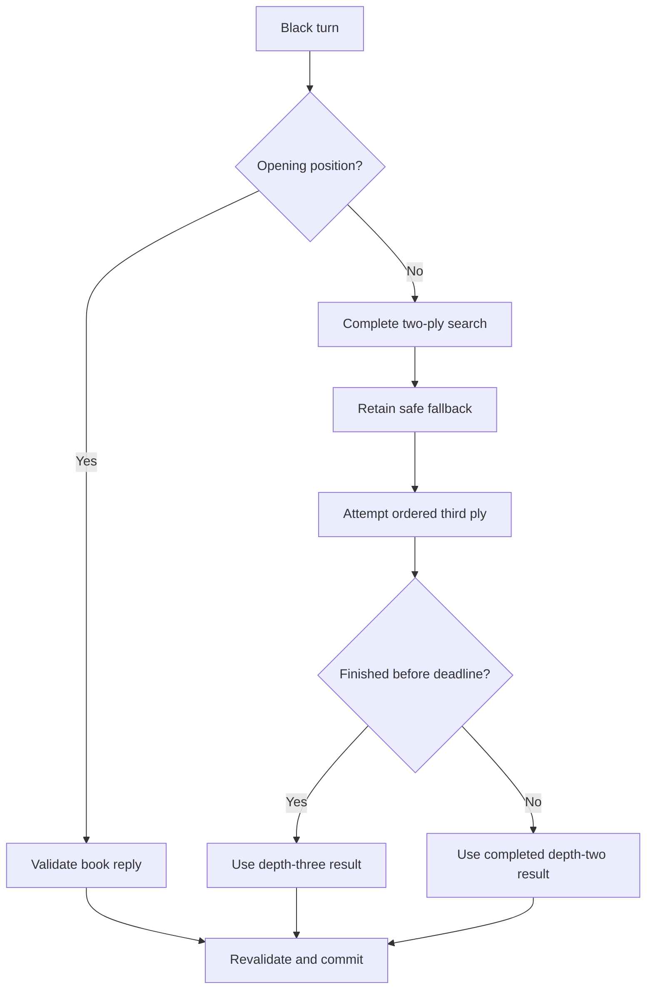

# QX-11 Chess

**A native chess game and computer opponent for the Epson QX-11**  
Created by San

QX-11 Chess is a 16-bit DOS `.COM` program written in 8086/8088 assembly for the Epson QX-11. It combines a complete playable chess game, a time-limited local computer opponent, native 640×400 graphics, dual chess clocks, sound effects, an opening library, and a move-hint system.

The project was developed iteratively and tested against the behavior of a real QX-11. It also became a practical demonstration of several previously undocumented QX-11 techniques: continuous 640×400 VRAM addressing, safe drawing across the 200-line hardware boundary, direct RTC interrupt timing, and direct SN76489 sound generation.

The current revision documented here is **Phase 6 II R10**. It retains the Phase 5/6 chess engine and uses the hardware-validated R10 compressed splash snapshot. The source analyzed for this document is `QX11_CHESS_COMPUTER_PHASE6II_R10.ASM`.

## Main features

- Human plays White; the QX-11 controls Black.
- Complete legal movement for pawns, knights, bishops, rooks, queens, and kings.
- King-safety validation: a move that leaves the moving side in check is rejected.
- Check, checkmate, and stalemate detection.
- Castling, en passant, promotion, capture, and underpromotion support.
- Large `384×288` board using both halves of the 640×400 display.
- Native detailed `40×32` Staunton-style piece artwork.
- Dithered light squares and opaque pieces.
- Legal-move and capture markers.
- Eight recent half-moves shown on screen.
- Independent ten-minute analog chess clocks.
- Time forfeiture with winner announcement and alarm.
- RTC-timed computer search with a five-second minimum presentation time and a 15-second search limit.
- Multi-ply opening library.
- Positional evaluation, alpha-beta pruning, bounded quiescence, and anti-repetition scoring.
- Direct `H` key hint with blinking source/destination markers and written notation such as `HINT B1 TO C3`.
- Pause, Restart, and Quit menu.
- SN76489 move, capture, illegal-move, check, flag-fall, and startup sounds.
- Startup splash screen showing `QX-11 CHESS`, `CREATED BY SAN`, and `PHASE 6 II`.
- Embedded, compressed R10 VRAM snapshot restored with short hardware-safe transfers.

## Controls

| Key | Action |
|---|---|
| Arrow keys | Move the board cursor or menu selection |
| Enter | Select a piece, confirm a destination, or choose a menu option |
| Enter on the selected source | Cancel the pending move |
| Q / R / B / N | Choose a promotion piece when requested |
| H | Calculate and display a hint during White's turn |
| Esc | Open or close the `PAUSE / RESTART / QUIT` menu |
| Any key while a hint is displayed | Dismiss the hint and restore the normal cursor |

`PAUSE` freezes both clocks. `RESTART` restores the initial position, resets both clocks to ten minutes, gives White the move, restores all castling rights, clears en passant and move history, and places the cursor on e2. `QUIT` silences the sound chip, restores the original RTC state and interrupt vector, selects BIOS video Mode 7 to clear the screen, and returns to DOS.

## Program architecture

The program is divided into four cooperating systems:

1. **Chess state and rules** — owns the board, move legality, special rules, history, and terminal-state detection.
2. **Computer opponent** — searches only temporary logical positions and never draws speculative moves.
3. **QX-11 renderer** — converts board coordinates and graphical objects into the machine's column-organized VRAM layout.
4. **Hardware services** — handles RTC timing in the foreground and drives the SN76489 sound generator.

The most important architectural rule is that the computer does not have a separate move executor. After search selects a move, the move is reconstructed, validated again, and committed through the same path used for a human move. This keeps captures, castling, en passant, promotion, history, clocks, sounds, check detection, and display updates synchronized.

### Startup and restart flow

Startup follows a deliberate hardware sequence:

1. Select BIOS video Mode 7 with `INT 10h`.
2. Apply the display-controller initialization recovered from Epson `PRE.EXE`.
3. Restore the embedded R10 compressed VRAM snapshot.
4. Play the splash tune and wait for a key.
5. Build the live game screen and initial chess position.
6. Install the RTC clock handler.

Restart does not replay the splash and does not reinstall the RTC vector. It pauses clock accounting, clears game state, uses the BIOS scroll-window service to clear the screen safely, reapplies the `PRE.EXE` display-controller state, loads the permanent lower-screen bitmap, draws the board and pieces, and resumes with two fresh ten-minute clocks.

## Logical board and move state

The board is a 64-byte row-major array:

```text
index = row * 8 + column
row 0 = rank 8
row 7 = rank 1
column 0 = file a
column 7 = file h
```

Each byte stores the piece type in the low bits and the side in bit 7:

```text
0 = empty
1 = pawn
2 = knight
3 = bishop
4 = rook
5 = queen
6 = king
80h = Black
```

A 256-entry circular history stores eight bytes per committed move: source, destination, moving piece, captured piece, move flags, previous castling rights, previous en-passant square, and promotion piece. The history drives the on-screen move list, opening-book matching, and the immediate-reversal penalty.

### Legal-move processing

For a selected piece, the rules engine examines every destination square and builds an eight-byte legal-move mask. Validation checks:

- Board bounds and ownership.
- Piece-specific movement.
- Blocking pieces on sliding paths.
- Ordinary pawn movement, double steps, and diagonal captures.
- Castling rights, empty path, and attacks on the starting, transit, and destination squares.
- En passant availability immediately after a qualifying pawn double step.
- Promotion on the last rank.
- King safety after temporarily applying the candidate move.

After a committed move, the engine searches for at least one legal reply. No reply while in check is checkmate; no reply while safe is stalemate.

## Computer-opponent logic

The final engine uses iterative search designed around the speed of the QX-11's 8088-class CPU.



### Opening library

Phase 6 contains 41 exact opening positions covering as many as nine previous half-moves. The library includes King's Pawn, Italian, Bishop's Opening, Ruy Lopez, Scotch, Vienna, King's Gambit, Queen's Pawn, Queen's Gambit Declined, London, Colle, English, Réti, Larsen, Bird, King's Fianchetto, Van Geet, and Anderssen setups.

Every book reply still passes through the complete legal-move validator. If the recorded history is not found or the reply is illegal in the live position, the engine falls back to normal search.

### Iterative search

Off-book, the engine:

1. Completes a two-ply search: Black move followed by White's strongest reply.
2. Retains that fully completed legal move as a guaranteed fallback.
3. Attempts a three-ply search: Black move, White reply, and Black continuation.
4. Orders promotions, valuable captures, other captures, and checks before quiet moves.
5. Uses alpha-beta cutoffs to avoid branches that cannot change the result.
6. Stops the deeper pass at the 15-second RTC deadline and uses the saved two-ply answer if depth three is incomplete.

Search begins immediately when `COMPUTER THINKING` appears. If it finishes in less than five seconds, the message continues blinking until the five-second minimum. If it takes longer, the move is played as soon as the completed search returns. All of this time belongs to Black's clock. Flag fall aborts the search and prevents a post-expiration move.

### Evaluation

Material uses centipawn-style values:

| Piece | Value |
|---|---:|
| Pawn | 100 |
| Knight | 320 |
| Bishop | 330 |
| Rook | 500 |
| Queen | 900 |
| Promotion gain | 800 |
| Checkmate | ±30000 |
| Stalemate | 0 |

Small signed piece-square tables add pawn advancement, central control, minor-piece development, rook activity, queen activity, and king safety. These values are intentionally much smaller than a pawn so that positional preferences break quiet ties without hiding clear material gains or losses.

An immediate reversal of Black's previous move receives a 75-point penalty. This was added after material-only positions repeatedly produced `a8-b8` followed by `b8-a8`. The move remains legal and can still be selected when tactically necessary.

### Bounded quiescence

At a completed third-ply leaf, the engine extends the position through forcing captures:

1. Evaluate the current position.
2. Examine every legal White capture or promotion.
3. Examine every legal Black capture or promotion in reply.

Either side may retain the current static score. This resolves common exchange sequences without permitting an unbounded capture search to consume the entire clock on a 4.9 MHz machine.

### Safe speculative search

Before a speculative move, the search saves:

- All 64 board bytes.
- Side to move.
- Castling rights.
- En-passant square.
- Source piece and coordinates needed by the validator.

It temporarily applies the move only to logical state, evaluates the branch, and restores every saved byte before continuing. Search never writes VRAM, records history, changes clocks, or produces sound.

## Hint system

Pressing `H` during White's turn freezes both clocks and evaluates every legal White move against every legal immediate Black reply. The selected hint is White's best worst-case result using the Phase 5 positional evaluator.

The hint does not move a piece or alter the game state. It:

- Hides the ordinary cursor.
- Displays the move in coordinate form, for example `HINT B1 TO C3`.
- Blinks strong source and destination markers at the RTC rate.
- Restores the board and cursor exactly when dismissed.

From the initial position, the deterministic hint is `Nb1-c3`.

## QX-11 640×400 VRAM mapping

Mode 7 is treated as one continuous 640×400 monochrome canvas even though the visible display is divided into two 200-line regions.

For `X=0..639` and `Y=0..399`:

```text
x_byte  = X >> 3
bit     = 80h >> (X & 7)

if Y < 200:
    y_index = Y
else:
    y_index = 0100h + (Y - 200)

offset = (x_byte << 9) + y_index
address = 8000h:offset
```

The lower half can equivalently be addressed as segment `8010h` with local `Y=0..199`. In physical-address terms, `8000h:0100h` and `8010h:0000h` identify the same byte.

The `0200h` step between byte-columns is the key QX-11 detail. VRAM is not a conventional linear scanline framebuffer. Every drawing primitive converts global coordinates through this mapping, which lets objects cross `Y=199/200` without clipping or displacement.

Normal drawing writes only the pixel VRAM areas needed by the game. Display initialization is a separate, explicit step that reproduces the values recovered from Epson `PRE.EXE`:

```text
8000:C060 = 35h
8000:D068 = 02h
8000:C261 = 00h
8000:C462 = 00h
8000:C663 = 00h
```

The same initialization is repeated after the BIOS clear used by Restart because that BIOS service may alter display state.

## Board and sprite rendering

The board occupies:

```text
X = 128..512
Y = 8..296
Square size = 48×36 pixels
Board size  = 384×288 pixels
```

Exactly 192 board scanlines appear above the 200-line boundary and 96 below it, so two thirds of the board is in the upper region and one third is in the lower region.

Light-square interiors use an alternating one-pixel checker pattern equivalent to `AAh` and `55h` on successive rows. Dark squares remain clear.

All six piece types are stored as native `48×32` packed bitmaps arranged as six QX-11 byte-columns by 32 rows. The visible artwork occupies the centered `40×32` region. White uses outlined Staunton-style art and Black uses solid art.

The pieces are opaque rather than XOR sprites. Each has visible artwork and a solid silhouette mask:

```text
draw = (destination AND NOT mask) OR artwork
```

When a piece moves, only its masked silhouette is restored:

```text
erase = (destination AND NOT mask) OR (board_pattern AND mask)
```

This prevents dither from showing through a piece and restores the exact square texture after movement, capture, castling, en passant, or promotion. The same masked renderer is used for pawns, knights, bishops, rooks, queens, and kings, including when a piece spans the `Y=199/200` boundary.

Selection frames, legal-move markers, hint markers, clock hands, status messages, recent moves, and the active-clock underline use reversible XOR overlays. Calling an overlay routine twice against unchanged state restores the original VRAM byte-for-byte.

### Static and compressed bitmap transfers

The permanent lower-screen artwork is a build-time `INCBIN` asset containing 80 consecutive columns of 200 bytes. The loader copies only those visible 200 bytes, then skips to the next `0200h` VRAM column. It never writes the unused gap between visible column data.

The splash is an embedded compressed VRAM snapshot. Each record is:

```text
word destination_offset
byte literal_length       ; 1..255
byte literal_data[length]
```

`FFFFh` terminates the stream. Zero areas are omitted because Mode 7 has already cleared the display. Literal runs are limited to 255 bytes, avoiding the long uninterrupted VRAM transfer that was unreliable on real hardware.

Although the source still contains an unused `IMG.DAT` filename and buffers, the R10 startup path does not open or read `IMG.DAT`; it calls `DrawCompressedVRAMSnapshot` and uses the embedded `QXCHESS_PHASE6II_VRAM_R10.BIN` data.

## Clocks and RTC interrupt handling

The QX-11's HD146818-compatible RTC is accessed through ports `10h` and `11h`. The game installs an `INT 7Ah` handler, enables the RTC periodic interrupt at 2 Hz, and converts every two periodic events into one elapsed chess-clock second.

The interrupt handler deliberately does very little:

- Acknowledges the RTC interrupt.
- Records which player owned the turn.
- Queues elapsed seconds and blink events.
- Never draws into VRAM.
- Never generates sound.

The foreground loop consumes the queued work, updates the clock state, erases and redraws the reversible hands, processes flag fall, and updates blinking messages. This avoids performing slow video or sound operations inside interrupt context.

On exit, the original `INT 7Ah` vector and RTC register values are restored.

## Sound

Sound is generated directly through the QX-11 SN76489AN at port `14h`.

- Tone channel 0 produces move, check, flag-fall, and melody tones.
- The noise channel adds capture and illegal-move accents.
- A longer foreground alarm announces time forfeiture.
- A short tune accompanies the Phase 6 II splash screen.
- All channels are silenced before returning to DOS.

## Display and presentation

Phase 6 II adds a finished presentation layer without changing the chess engine:

- Startup splash: `QX-11 CHESS`, `CREATED BY SAN`, and `PHASE 6 II`.
- Short startup tune.
- Large centered menu box with clear `PAUSE`, `RESTART`, and `QUIT` options.
- The current menu selection is highlighted.
- `H` invokes the hint directly instead of placing Hint inside the menu.
- Written hint notation and stronger blinking source/destination indicators.
- Clean Mode 7 reset and screen clear before returning to DOS.

R10 stores the complete splash appearance as a hardware-validated VRAM snapshot rather than rebuilding it pixel by pixel during every launch. The snapshot is compiled into the executable, decompressed directly to segment `8000h`, followed by the original six-note PSG tune and a wait for any key.

## Development phases

| Phase | Result |
|---|---|
| Graphics/rules foundation | Native QX-11 board, pieces, cursor, legal moves, captures, check, mate, stalemate, castling, en passant, promotion, history, clocks, and sound |
| Phase 1 | Automatic Black turns and four opening replies; off-book fallback selected the first legal move |
| Phase 2 | Full legal-move scan and immediate material scoring |
| Phase 2.1 | RTC-blinking thinking message, terminal flag fall, winner display, and long alarm |
| Phase 3 | Two-ply best-worst search that recognizes immediate recaptures |
| Layout revision | Board enlarged across the two VRAM regions; native detailed pieces added |
| Phase 4 | Dithered squares, opaque sprite correction, ordered three-ply search, alpha-beta pruning, and deadline fallback |
| Phase 5 | Positional evaluation, bounded quiescence, and anti-reversal scoring |
| Phase 6 | 41-position opening library, Pause/Restart/Quit controls, and reply-aware hints |
| Phase 6 II | Splash, tune, large highlighted menu, direct `H` hint, written hint text, and clean exit presentation |
| R10 | Embedded compressed hardware-validated VRAM splash snapshot with short literal transfers |

## Building

The final source is intended for NASM as 16-bit 8086 code:

```bash
nasm -f bin QX11_CHESS_COMPUTER_PHASE6II_R10.ASM -o QXAI6II.COM
```

The following two build-time assets must be in the same directory because the source includes them with `INCBIN`:

```text
QXCHESS_PHASE6II_BOTTOM.BIN
QXCHESS_PHASE6II_VRAM_R10.BIN
```

They become part of the generated `.COM` file. The final executable does not need either `.BIN` file—or `IMG.DAT`—at runtime.

The program is a DOS `.COM` image assembled with:

```text
BITS 16
CPU 8086
ORG 100h
```

The source has been checked for valid 8086 syntax and successfully assembled through the project's NASM-compatible GNU assembler conversion path using substitute `INCBIN` data. A byte-for-byte release build still requires the two exact bitmap assets listed above. This README therefore does not publish an unverified R10 executable size or checksum; add those after assembling and hashing the exact `.COM` uploaded to GitHub.

## Verification

During development, automated regression programs exercised both the generated machine code and the major state transitions. Tests cover:

- Every ordinary piece rule and blocked sliding path.
- King safety, check, checkmate, and stalemate.
- Castling, en passant, promotion, and underpromotion.
- Common human/computer move commitment.
- Opening-book legality and multi-move continuation.
- Immediate-recapture avoidance in the two-ply engine.
- Tactical improvement from the third ply.
- Alpha-beta cutoffs and RTC deadline fallback.
- Positional scoring, quiescence, and anti-reversal scoring.
- Byte-for-byte restoration after speculative search.
- RTC clock ownership, pause, resume, flag fall, and alarm behavior.
- Exact SN76489 command streams and a silent RTC interrupt handler.
- Dither continuity and opaque-piece restoration across `Y=199/200`.
- Reversible menu, cursor, legal-move, and hint overlays.
- Restart restoration of board, clocks, history, castling, en passant, turn, and cursor state.

A useful engine regression presents Black with a poisoned queen capture. The two-ply engine rejects `Qxe7?`, because White can answer `fxe7`, and instead chooses the safe `Rxa7`. A separate Phase 4 position proves that the completed third ply can change the selected move rather than merely repeating the depth-two result.

## Current limitations

- The human always plays White and the computer always plays Black.
- There is one fixed search-time policy rather than selectable difficulty levels.
- Threefold repetition, the fifty-move rule, and insufficient-material draws are not yet implemented.
- The opening library matches exact recorded sequences; transpositions require their own records.
- The hint search examines White's move and Black's immediate reply rather than running the full computer search.
- Save/load, undo, and move replay are not implemented.

## Suggested repository contents

```text
README.md
QX11_CHESS_COMPUTER_PHASE6II_R10.ASM
QXAI6II.COM
QXCHESS_PHASE6II_BOTTOM.BIN
QXCHESS_PHASE6II_VRAM_R10.BIN
screenshots/
```

The older phase sources are also valuable to preserve. Together they document how a simple first-legal-move opponent evolved into a practical chess engine on original mid-1980s hardware.

